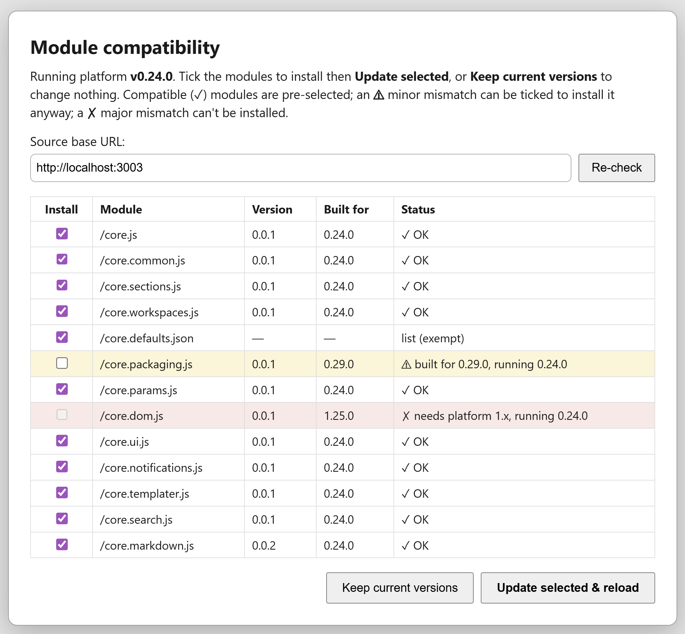

# Modules & Packages

The Twikki Platform loads code via HTTP:
* It's core behaviour via modules (fixed)
* Base functionality via a `base` package (defined in $CorePackages)
* Custom/user functionality listed in $ExtensionPackages

**Note:** An important distinction between modules and packages is that modules apply across all workspaces whereas packages are defined per-workspace. For a given host (domain/localStorage) you have one version of standard modules installed but each workspace may have different versions of packages/plugins.

> For developers, both modules and packages are bundled from source files by the custom [COMPILER.md](./COMPILER.md) into `.json`.
> This document covers what happens **after** compilation — the runtime side.

The platform lives in [src/platform/twikki.platform.js](../src/platform/twikki.platform.js) which is the only script referenced in index.html. It will load modules from `window.MODULE_URL/modules` which you can override.

## Modules
* `core.js`: Basic API
  * `events`: Basic event bus (pub/sub)
  * `run`:
    * `getTiddler` helper function for accessing tiddlers.
  * `extensions`: Interface for extensions/plugins
    * `registerMacro`: Register a new macro/widget
    * `registerCommand` / `registerCommandProvider`: Register command palette command(s); a provider is a function re-evaluated at palette render for runtime-varying lists
* `core.common`: Common functionality shared in the codebase (hashing, sorting, html escaping)
* `core.sections`: Functionality for ContentSections
* `core.workspaces`: Functionality for Workspaces
* `core.default.json`: Essential tiddlers/content we need to run. These "shadow" tiddlers can be overridden by users. Some examples are:
  * Icons: Some basic (ugly) icons. Users will typically load their own "icons" package.
  * Themes: 2 basic themes (CoreThemeLight & CoreThemeDark)
  * Layout: Templates for the main site's HTML ($MainLayout) or parts thereof ($TiddlerDisplay)
* `core.packaging`: Functionality for loading and handling packages
* `core.parameters`: Functionality for handling Parameters in widgets and macros
* `core.dom`: Functionality for dealing with the DOM
* `core.ui`: Functionality for generating the UI (buttons, dialogs, sections)
* `core.notifications`: Functionality for showing alerts and messages
* `core.templater`: Tiny mustache-style template engine
* `core.search`: Search functions


### Updates
Update logic is managed in `loadCoreModule(moduleName)`.
Modules are cached in localStorage and re-downloaded when:
* the platform version changes (a `/modules.version` stamp is compared against `VERSION` on boot — platform and modules ship together, so a new platform never runs against stale incompatible modules), or
* `?update` / `?reload` is passed in the URL (needed during development when module sources change without a version bump).

### Versioning & compatibility



Every core code module declares two **independent** version fields near the top of its source, as plain `const` literals (the platform reads them statically — see below):

```js
const name = 'core.ui';
const version = '0.0.1';   // the module's OWN version
const platform = '0.24.0'; // the platform release this module was built for
```

and returns both in its meta object: `return {name, version, platform, exports, run};`.

- **`version`** — the module's own API/behaviour, following semver: bump the **major** for a breaking API change (a method renamed or removed), the **minor** for a new feature, the **patch** for a bugfix. (While a module is in `0.x` the usual pre-1.0 caveat applies — the API is not yet declared stable — but the major/minor/patch *intent* above is what we follow.)
- **`platform`** — which platform release the module targets. Compatibility uses **caret / "min + same major"** semantics, identical to npm's `^`: a module built for `0.24.0` runs on platform `>= 0.24.0` *within the same major* (`0.24.x`, `0.99.x`, …) but **not** on an older platform (`0.23.x`) or a breaking one (`1.0.0`). The pure helper (`semver`/`semverCompare`/`caretSatisfies`) lives in `twikki.platform.js` between `/* BEGIN semver helper */` sentinels and is unit-tested by [tests/unit/semver.test.js](../tests/unit/semver.test.js).

**Two tiers of incompatibility.** `checkModuleCompat` classifies each module as one of:

- **ok** — compatible (`caretSatisfies` holds).
- **warn** — incompatible but the **same major** (built for a newer minor/patch), *or* no `platform` field at all. This is **overridable**: the user may install/keep it anyway.
- **block** — a **different major**: a breaking gap that **cannot** be overridden. (A failed download is also a block.)

**The compatibility gate.** During `init()`, before any module is `eval`'d, the platform **statically parses** each module's `const platform = '...'` from its source string (it can't run the module first — `eval` triggers the module's side effects) and classifies it against the running `VERSION`. The boot halts and opens the dialog when there is **any block**, or **any freshly-fetched warn** (a warning the user hasn't decided on yet — a warn module already in the cache booted before, so it boots again silently with a console warning). The list module (`core.defaults.json`) carries no code/version and is **exempt** (ok).

**The dialog (`showCompatDialog`)** is self-contained — plain DOM + inline styles on a native `<dialog>`, since it runs before `tw.ui`/theme stylesheets exist. It lists every module's version / built-for / status (✗ block rows red, ⚠ warn rows amber) and offers:

- **Update & reload** — store the shown modules and reload. Enabled unless something is a **block**, so a same-major ⚠ warning can be force-installed but a ✗ major mismatch cannot.
- **Keep current versions** — discard the update and reload using the already-installed (cached) modules. Offered only when a usable, non-blocking cached set exists.
- **Re-check** — repoint the **Source base URL** (persisted to the `/base.url` localStorage key) and re-fetch + re-validate before deciding.

Every loose `src/modules/*.js` is checked for the two fields by [tests/unit/module-compat.test.js](../tests/unit/module-compat.test.js).

### Fetching & caching
Two functions split the concern (so an incompatible download never clobbers the installed copy):

- **`fetchCoreModule(name)`** → `{res, fetched}` — returns the usable **cached** copy as-is (`fetched:false`) unless `?reload`/`?update` forces the network; otherwise downloads it (`fetched:true`). It **never writes** to `localStorage`.
- **`storeCoreModule(name, res)`** — the single write point (`/modules<name>`). Called only *after* the gate passes (persisting the freshly-fetched, validated set), or when the user clicks **Update** in the dialog.

There is **no** separate platform-version stamp and **no** automatic re-fetch when the platform version changes — each cached module's own source already carries its `version`/`platform`, and the gate decides compatibility from that. Modules are therefore downloaded only on a first/empty cache, on `?reload`/`?update`, or when the user updates from the dialog. A cached module is considered usable when it carries a payload (`res.code` for code modules, `res.tiddlers` for the list module — the old `!res?.code` test wrongly re-downloaded list modules every boot).
