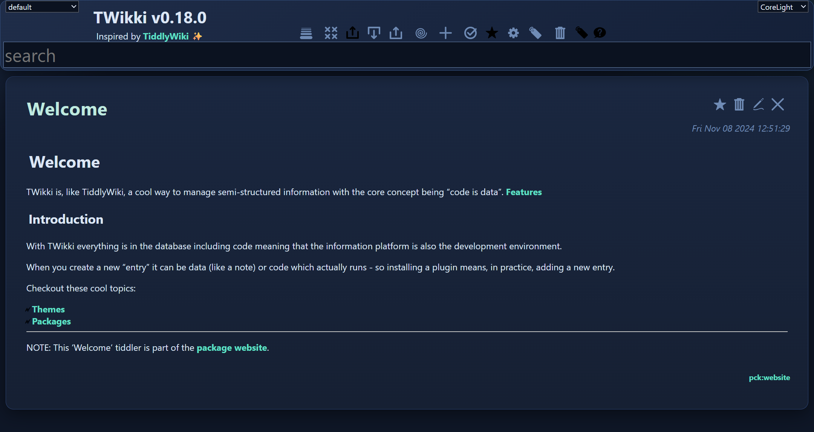
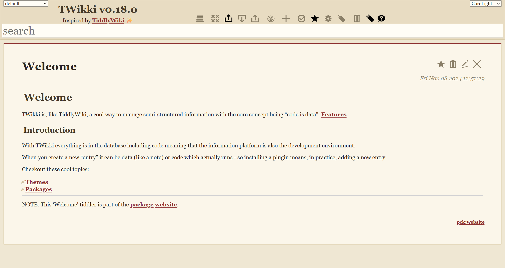
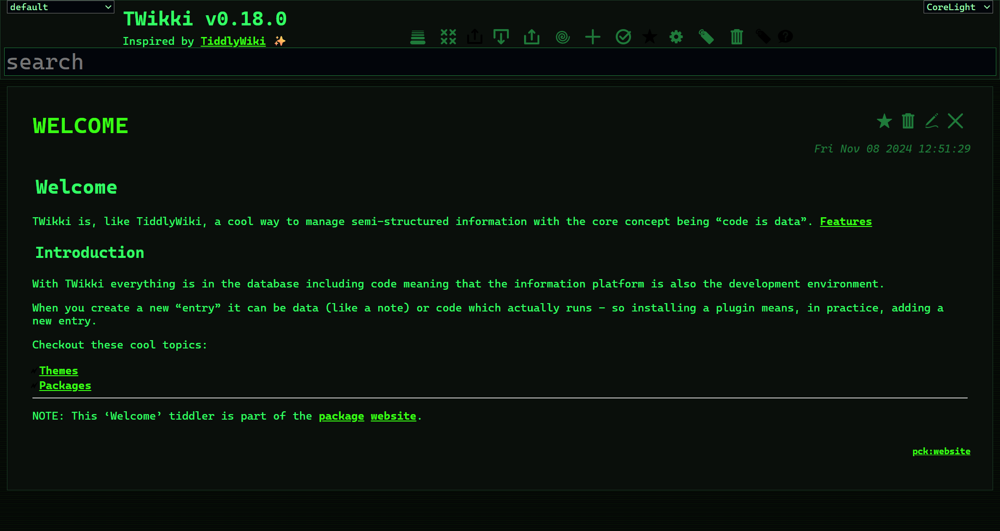
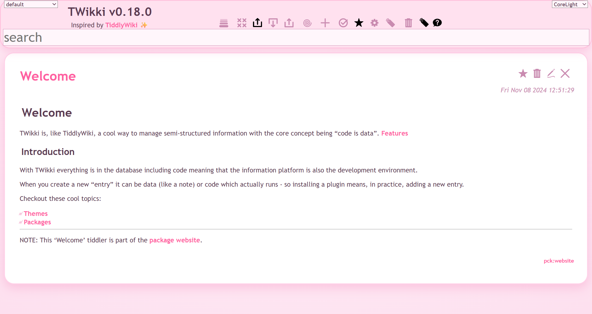
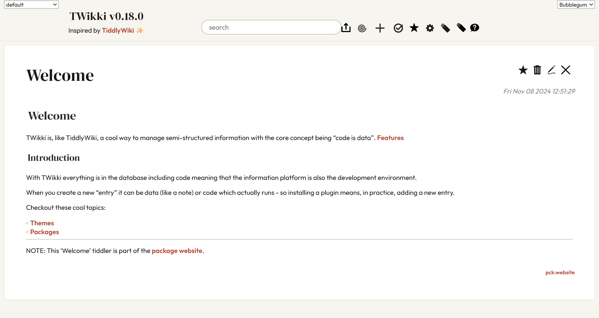
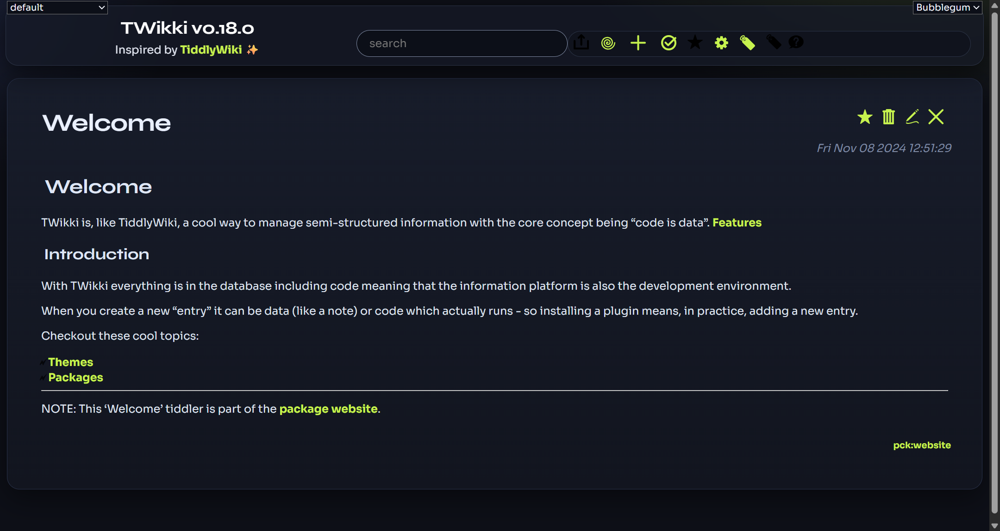
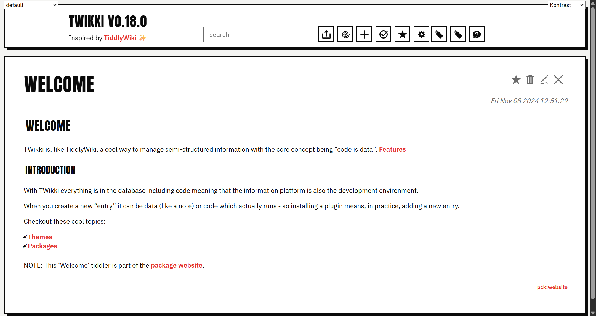

# TWikki Themes

TWikki's look is driven entirely by **data, not a build step**. A theme is just a
tiddler tagged `$Theme` whose body lists the stylesheet tiddlers to apply.

```
tags: $Theme

* [[$CoreThemeLayout]]
* [[$CoreThemeAppearance]]
* [[MyPalette]]
```

`$CoreThemeManager` composes those into one constructable stylesheet wrapped in three
[CSS cascade layers](https://developer.mozilla.org/en-US/docs/Web/CSS/@layer) and
adopts it at runtime, so switching or editing a theme re-paints instantly with no
reload.

```js
tw.events.send('theme.switch', 'AuroraTheme');
```

---

## The three layers

```css
@layer base, theme, user;
```

| Layer | Contents | Core default tiddlers |
|---|---|---|
| **base** | Reset rules + `:root` token declarations | `$BaseReset`, `$BaseVariables` |
| **theme** | Whatever the active `$Theme` tiddler's bullet list points to | `$CoreThemeLayout`, `$CoreThemeAppearance`, `$CoreThemePalette` |
| **user** | `$StyleSheetUser` (delivered empty) | — |

Two guarantees from `@layer`:

- **Theme rules beat base rules** regardless of selector specificity.
- **User rules beat both** regardless of selector specificity.

The base layer is hard-coded into `$CoreThemeManager` — a theme cannot opt out. The
user layer is wrapped automatically; a theme cannot lock it out. The theme layer is
yours.

### What lives where

- `$BaseReset` — browser normalization (box-sizing, list/image resets).
- `$BaseVariables` — every CSS variable used anywhere, with light defaults
  (`--col*`, `--colbg*`, `--col-on-accent`, `--col-error`, `--rad*`, `--sidebar-w`,
  `--accent`, `--tab-bg`, …). The contract every component depends on; new tokens go
  here. Enforced by [`tests/unit/tokens.test.js`](../tests/unit/tokens.test.js), which
  fails if any `var(--x)` reference in `src/` has no matching declaration.
- `$CoreThemeLayout` — app-shell grid, sidebar/main flex internals, responsive drawer,
  header-bar variant. Structural rules only.
- `$CoreThemeAppearance` — token-driven component appearance: sidebar, picker, tabs,
  cards, dialogs, buttons, forms, typography, code blocks, notifications, settings form.
  Reads tokens from the base layer.
- `$CoreThemePalette` — placeholder for the **light** palette; intentionally empty
  because the light defaults already live in `$BaseVariables`. Custom light themes can
  supply their own `*Palette` in its place.
- `$CoreThemeDarkPalette` — `:root` overrides that turn the UI dark.

### Light vs dark

The default `$Theme` is `$CoreThemeLight`. Dark mode is just a different bullet list:

```
title: $CoreThemeLight
tags: $Theme

* [[$CoreThemeLayout]]
* [[$CoreThemeAppearance]]
* [[$CoreThemePalette]]
```

```
title: $CoreThemeDark
tags: $Theme, $ThemeDark

* [[$CoreThemeLayout]]
* [[$CoreThemeAppearance]]
* [[$CoreThemeDarkPalette]]
```

The `$ThemeDark` tag is **not** part of the cascade. Its only job is to flip the
syntax highlighter between `highlight-light` and `highlight-dark`. Any dark theme
should carry it; light themes should not.

---

## Built-in themes

These live in `src/packages/themes/`. Switch between them with the theme selector
in the sidebar, or via `tw.events.send('theme.switch', 'AuroraTheme')`.

### Aurora — dark, cool, glassy


Deep navy canvas with a cyan glow, gradient glass cards, soft drop-shadows and mint
accents. A modern dark-dashboard feel.

### Manuscript — light, editorial


Warm parchment background, Georgia serif throughout, an oxblood accent rule on each
card and hairline borders. Reads like print.

### Terminal — brutalist / retro CRT


Near-black surface, phosphor-green monospace, zero border radius, hard 1px borders,
uppercase titles and a subtle scanline texture.

### Bubblegum — soft, playful


Pastel pink wash, candy accents, chunky 24px rounded cards and soft glow shadows.
Toy-like and friendly.

### Broadsheet — editorial, light


**DM Serif Display** titles over an **Outfit** body. The header flattens to a hairline
bar with a centred pill search, the toolbar is trimmed to essentials, and content sits
in a centred 820px reading column. Terracotta accent.

### Nocturne — dark, tech


**Syne** display titles with a **Sora** body. A floating glass header with a blurred
backdrop, the toolbar collapsed into a rounded pill of chartreuse icons, and dark
gradient cards. Lime `#c6f24e` accent.

### Kontrast — Swiss / neo-brutalist


**Anton** condensed uppercase titles with an **IBM Plex Sans** body. Thick 2px black
borders, hard 6px offset shadows, a square search box and a segmented row of bordered
icon boxes. Red `#e5322d` accent.

### Obsidian — modern dark with violet accent
A dense dark theme used as TWikki's previous default. Now ships as a regular theme
in the same package.

---

## Creating your own

A theme is a `$Theme`-tagged tiddler whose bullet list names everything that should
end up in the `theme` cascade layer.

**Tokens-only theme** — change colours and radii without touching layout or component
CSS:

```
title: MyTheme
tags: $Theme

* [[$CoreThemeLayout]]
* [[$CoreThemeAppearance]]
* [[MyTheme::MyPalette]]
```

```
# MyPalette
tags: $StyleSheet
```css
:root {
  --colbg1: #1a1a2e;
  --colbg2: #16213e;
  --col6:   #e94560;
}
```
```

You don't have to copy every variable from `$BaseVariables` — only the ones you want
to change. The rest inherit from the base layer.

**Theme with custom layout** — Broadsheet, Nocturne and Kontrast restructure the
header. They ship their own structural CSS in the same palette section (which is fine
since the theme layer can win over the base layer), or in a separate `*Layout`
section. Either way, list it in the bullet list before the palette so the palette can
re-tweak it.

### Dark themes

Tag your dark theme `$Theme, $ThemeDark`. The runtime uses the tag (not the theme
name) to switch the syntax highlighter between light and dark sheets. No naming
convention required — you can call your dark theme `Midnight` or `Cthulhu` and it'll
work.

### Where things live

- A `.css` file in `src/packages/themes/` becomes a standalone `$StyleSheet`-tagged
  tiddler whose title is the filename.
- A `.tid` file with `# Section` markers inside it becomes one parent tiddler plus
  named sub-sections, addressable as `[[ParentName::SectionName]]`. Use this to ship
  a theme as a single file (theme tiddler + palette section), as the built-ins do.

### Web fonts

`@import` is stripped from constructable stylesheets, so the Google Fonts copy-paste
snippet won't work. Use `@font-face` directly instead — it loads fine:

```css
@font-face {
  font-family: 'Outfit';
  src: url('https://cdn.jsdelivr.net/npm/@fontsource/outfit/files/outfit-latin-400-normal.woff2') format('woff2');
  font-weight: 400;
  font-display: swap;
}
* { font-family: 'Outfit', system-ui, sans-serif; }
```

For a fully offline theme, embed the font as a base64 `data:` URI in the `src` instead
of a CDN URL — the font then travels with the wiki and syncs like any other tiddler.

> **Search visibility:** theme and stylesheet tiddlers are hidden from normal search
> by default — the `$Theme` and `$StyleSheet` tags are in the `excludeTags` list on
> the **Search** tab of `$GeneralSettings`. They still appear in the theme selector
> and in an explicit `tag:$Theme` / `$`-prefixed search. Edit
> `includeTags`/`excludeTags` to change which tags are hidden — no renaming required.

---

## User overrides

Anything you put in `$StyleSheetUser` lands in the `user` layer and wins over the
active theme regardless of selector specificity. Use it for personal tweaks without
forking a theme:

```css
:root {
  --col6: hotpink;          /* recolour every link */
}
div.tiddler { max-width: 1100px; }
```
